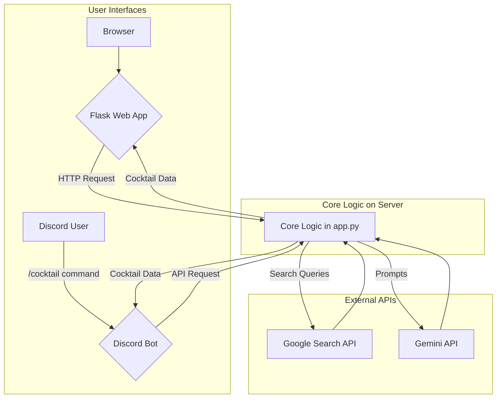

# 🍸 BookCocktail: AI-Powered Insight Generator

[](https://opensource.org/licenses/MIT)

**BookCocktail** is an intelligent application that takes a book title or a URL to an article and generates a "cocktail" of insights. It provides a "base" (complementary information), a "spice" (contrasting viewpoints), and a "secret ingredient" (tangential ideas) to deepen your understanding of the original work.

This project offers both a web application and a Discord bot.

## ✨ Key Features

-   **AI-Powered Analysis**: Utilizes Google's Gemini API to generate insightful commentary and search queries.
-   **Multi-Source Synthesis**: Leverages Google Search to find diverse perspectives on any given topic.
-   **URL & Title Input**: Accepts both direct URLs and book/article titles as input.
-   **Dual Interface**: Accessible as an interactive web app or a convenient Discord bot.
-   **Easy Deployment**: Includes clear instructions for deploying on the Render platform.

## 🏛️ Architecture

The project consists of two main components: a Flask web server (`app.py`) that contains the core logic, and a Discord bot (`discord_bot.py`) that communicates with the Flask server's API.



## 🔧 Prerequisites

To run this project, you will need API keys from Google and a Discord Bot Token.

-   **Google API Key**: For Google Custom Search and Gemini API.
    -   Enable the **Custom Search API** and the **Generative Language API** in your Google Cloud project.
-   **Google Search Engine ID**: A specific ID for your configured custom search engine.
-   **Discord Bot Token**: To run the Discord bot.

## 🚀 Local Setup and Execution

Follow these steps to run the application on your local machine.

### 1. Environment Setup

First, clone the repository and set up the necessary environment variables.

1.  **Clone the repository:**
    ```bash
    git clone https://github.com/KereruA0i/Book-Cocktail.git
    cd Book-Cocktail
    ```

2.  **Create a virtual environment and activate it:**
    ```bash
    python3 -m venv venv
    source venv/bin/activate
    ```

3.  **Install dependencies:**
    ```bash
    pip install --upgrade pip
    pip install -r requirements.txt
    ```

4.  **Configure environment variables:**
    Create a file named `.env` in the project root and add your API keys.

    ```env
    # .env file
    # For core logic (app.py)
    GOOGLE_API_KEY="YOUR_GOOGLE_SEARCH_API_KEY"
    SEARCH_ENGINE_ID="YOUR_SEARCH_ENGINE_ID"
    GEMINI_API_KEY="YOUR_GEMINI_API_KEY"

    # For Discord bot (discord_bot.py)
    DISCORD_TOKEN="YOUR_DISCORD_BOT_TOKEN"
    ```

### 2. Run the Web App & API Server

The Flask application (`app.py`) serves both the web interface and the API for the Discord bot.

```bash
# In your terminal
python app.py
```

You can now access the web app at `http://127.0.0.1:5000`.

### 3. Run the Discord Bot

To run the Discord bot, open a **new terminal window** and run the following command.

```bash
# In a second terminal
python discord_bot.py
```

The bot will connect to your local Flask server by default. You can now use the `/cocktail` command in your Discord server.

---

## ☁️ Deployment on Render

This guide explains how to deploy both the web app and the Discord bot on Render for continuous operation.

### 1. Deploy the Web App (Web Service)

1.  Navigate to your Render Dashboard and create a **New Web Service**.
2.  Connect your GitHub repository.
3.  Configure the service with the following settings:
    -   **Name**: `book-cocktail-web` (or your preferred name)
    -   **Region**: Your preferred region
    -   **Branch**: `main`
    -   **Build Command**: `pip install -r requirements.txt`
    -   **Start Command**: `gunicorn app:app`
4.  Under the **Environment** tab, add the following three secret files:
    -   `GOOGLE_API_KEY`
    -   `SEARCH_ENGINE_ID`
    -   `GEMINI_API_KEY`
5.  Click **Create Web Service**. After the build finishes, your web app will be live at the provided URL.

### 2. Deploy the Discord Bot (Background Worker)

The Discord bot runs as a separate process.

1.  Create a **New Background Worker** on the Render Dashboard.
2.  Connect the same GitHub repository.
3.  Configure the worker with the following settings:
    -   **Name**: `book-cocktail-bot`
    -   **Region**: Your preferred region
    -   **Branch**: `main`
    -   **Start Command**: `python discord_bot.py`
4.  Under the **Environment** tab, add the following two secret files:
    -   `DISCORD_TOKEN`: Your bot's token.
    -   `API_SERVER_URL`: The URL of your deployed Web Service (e.g., `https://book-cocktail-web.onrender.com/api/cocktail`).
5.  Click **Create Background Worker**. The bot will start and automatically connect to your live web service API.

### ⚠️ API Usage Warning

This application relies on external APIs with free usage limits.
*   **Google Custom Search API**: Limited to 100 queries per day (at the time of writing). Each cocktail generation may use multiple queries.
*   **Gemini API**: Rate limits vary (e.g., 15-60 requests per minute). High-frequency use might lead to temporary errors.

## 📂 Project Structure

```
.
├── app.py              # Core Flask application (Web UI + API)
├── discord_bot.py      # Discord bot client
├── requirements.txt    # Python dependencies
├── Procfile            # Defines process types for deployment (e.g., gunicorn)
├── .env.example        # Example environment variables file
├── static/             # CSS and JavaScript files
│   ├── script.js
│   └── style.css
└── templates/          # HTML templates for Flask
    └── index.html
```
